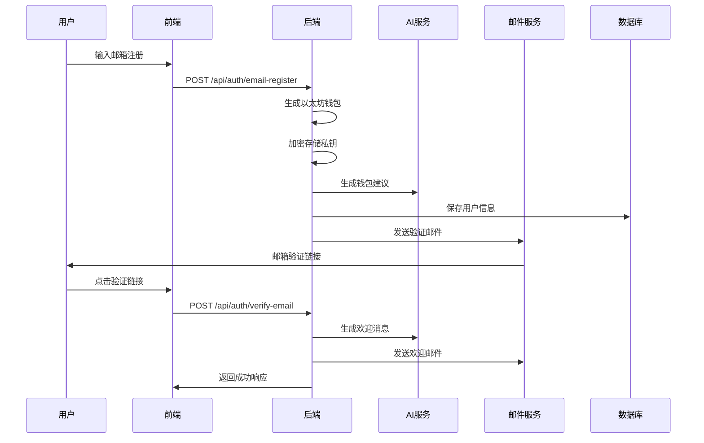
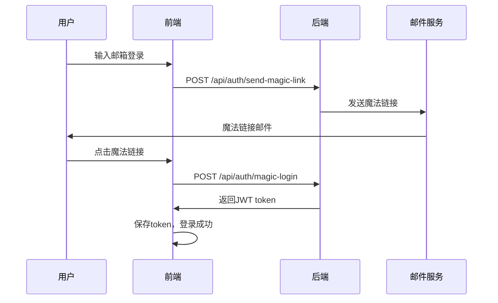
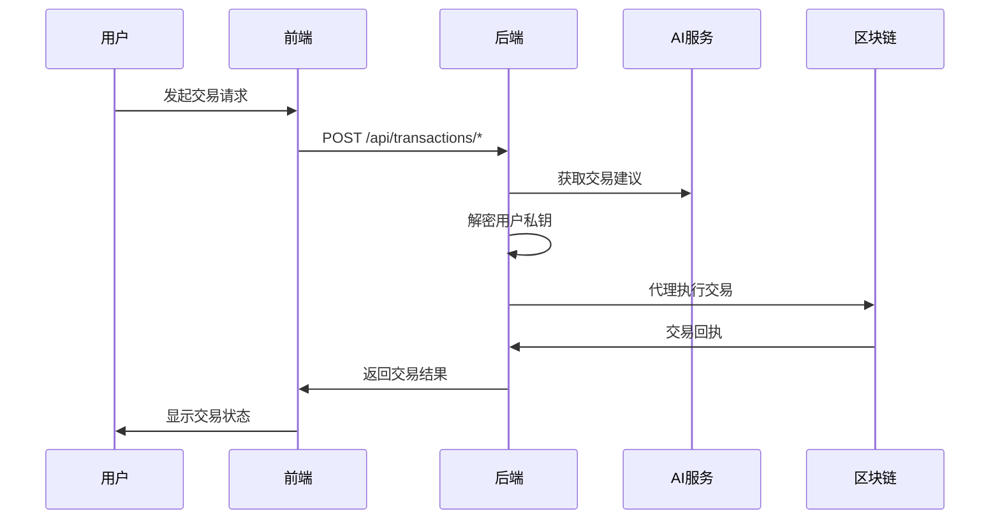

# 邮箱登录与AI集成文档

## 概述

whichWitch平台现在支持两种登录方式：
1. **钱包登录** - 传统的Web3钱包连接方式
2. **邮箱登录** - 通过AI Agent自动创建和管理钱包

## 核心功能

### 🔐 双重登录系统

#### 钱包登录（保持不变）
- 用户使用MetaMask等钱包连接
- 签名验证身份
- 直接控制私钥

#### 邮箱登录（新功能）
- 用户输入邮箱地址
- AI自动生成以太坊钱包
- 私钥加密存储在后端
- 代理执行所有区块链交易

### 🤖 AI Agent功能

#### 智能钱包管理
- 自动生成安全的以太坊钱包
- 私钥加密存储
- 智能交易代理
- 个性化建议

#### AI助手服务
- 钱包创建建议
- 交易风险评估
- 创作策略建议
- 智能客服

## 技术架构

### 后端服务结构

```
src/backend/
├── services/
│   ├── authService.js      # 认证服务
│   ├── aiService.js        # AI服务
│   └── transactionService.js # 交易代理服务
├── routes/
│   ├── auth.js            # 认证路由
│   ├── ai.js              # AI助手路由
│   └── transactions.js    # 交易代理路由
├── utils/
│   ├── emailService.js    # 邮件服务
│   └── supabaseClient.js  # 数据库客户端
├── middleware/
│   └── authMiddleware.js  # 认证中间件
└── server.js              # 主服务器
```

### 数据库扩展

新增用户管理表：
- `users` - 用户账户信息
- `email_verification_tokens` - 邮箱验证令牌
- `user_sessions` - 用户会话管理

## API接口

### 认证接口

#### 邮箱注册
```http
POST /api/auth/email-register
Content-Type: application/json

{
  "email": "user@example.com"
}
```

响应：
```json
{
  "success": true,
  "message": "Registration successful. Please check your email for verification.",
  "walletAddress": "0x...",
  "aiAdvice": "AI生成的钱包建议"
}
```

#### 邮箱验证
```http
POST /api/auth/verify-email
Content-Type: application/json

{
  "token": "verification_token"
}
```

#### 魔法链接登录
```http
POST /api/auth/send-magic-link
Content-Type: application/json

{
  "email": "user@example.com"
}
```

#### 钱包登录（保持不变）
```http
POST /api/auth/wallet-login
Content-Type: application/json

{
  "walletAddress": "0x...",
  "signature": "0x...",
  "message": "Login message"
}
```

### AI助手接口

#### 智能客服
```http
POST /api/ai/chat
Authorization: Bearer <token>
Content-Type: application/json

{
  "query": "如何创建我的第一个作品？"
}
```

#### 钱包管理建议
```http
GET /api/ai/wallet-management
Authorization: Bearer <token>
```

#### 创作建议
```http
POST /api/ai/creation-advice
Authorization: Bearer <token>
Content-Type: application/json

{
  "workType": "original",
  "parentWork": {}
}
```

#### 交易风险评估
```http
POST /api/ai/assess-risk
Authorization: Bearer <token>
Content-Type: application/json

{
  "transactionType": "registerOriginalWork",
  "amount": "0.1"
}
```

### 交易代理接口

#### 代理注册原创作品
```http
POST /api/transactions/register-original-work
Authorization: Bearer <token>
Content-Type: application/json

{
  "licenseFee": "100000000000000000",
  "derivativeAllowed": true,
  "metadataURI": "https://ipfs.io/ipfs/..."
}
```

#### 代理请求授权
```http
POST /api/transactions/request-authorization
Authorization: Bearer <token>
Content-Type: application/json

{
  "workId": "1",
  "licenseFee": "100000000000000000"
}
```

## 用户流程

### 邮箱用户注册流程



### 邮箱用户登录流程



### 交易代理流程



## AI功能详解

### Qwen模型集成

使用阿里云通义千问模型提供智能服务：

```javascript
// AI服务配置
const QWEN_API_KEY = process.env.QWEN_API_KEY;
const QWEN_BASE_URL = 'https://dashscope.aliyuncs.com/compatible-mode/v1';

// 调用示例
const response = await axios.post(`${QWEN_BASE_URL}/chat/completions`, {
  model: 'qwen-turbo',
  messages: [
    {
      role: 'system',
      content: '你是whichWitch平台的AI助手...'
    },
    {
      role: 'user',
      content: '用户的问题'
    }
  ],
  temperature: 0.7,
  max_tokens: 1000
});
```

### AI助手功能

#### 1. 钱包创建建议
- 分析用户邮箱和偏好
- 生成个性化安全建议
- 提供平台功能介绍

#### 2. 交易风险评估
- 分析交易类型和金额
- 评估风险等级
- 提供安全建议

#### 3. 创作策略建议
- 分析市场趋势
- 提供定价建议
- 推荐创作方向

#### 4. 智能客服
- 回答平台相关问题
- 提供操作指导
- 解决技术问题

## 安全考虑

### 私钥管理
- 使用AES-256-CBC加密算法
- 加密密钥独立存储
- 只在交易时临时解密

### 会话管理
- JWT token有效期7天
- 支持token刷新
- 安全的会话验证

### 邮件安全
- 验证链接24小时过期
- 魔法链接15分钟过期
- 防止重放攻击

### API安全
- 请求频率限制
- 输入参数验证
- 错误信息脱敏

## 部署配置

### 环境变量

```bash
# AI配置
QWEN_API_KEY=your_qwen_api_key_here
QWEN_BASE_URL=https://dashscope.aliyuncs.com/compatible-mode/v1

# 邮件配置
SMTP_HOST=smtp.gmail.com
SMTP_PORT=587
SMTP_USER=your_email@gmail.com
SMTP_PASS=your_app_password

# 安全配置
JWT_SECRET=your_jwt_secret_key
ENCRYPTION_KEY=your_32_byte_encryption_key

# 数据库配置
SUPABASE_URL=https://xxx.supabase.co
SUPABASE_SERVICE_KEY=eyJxxx...
```

### 启动服务

```bash
# 安装依赖
npm install

# 启动后端服务
npm run backend

# 开发模式
npm run backend:dev
```

## 前端集成

### 登录组件示例

```javascript
// 邮箱登录
const handleEmailLogin = async (email) => {
  try {
    const response = await fetch('/api/auth/send-magic-link', {
      method: 'POST',
      headers: { 'Content-Type': 'application/json' },
      body: JSON.stringify({ email })
    });
    
    const result = await response.json();
    if (result.success) {
      setMessage('请检查您的邮箱，点击登录链接');
    }
  } catch (error) {
    console.error('Login error:', error);
  }
};

// 钱包登录（保持不变）
const handleWalletLogin = async () => {
  // 现有的钱包连接逻辑
};
```

### AI助手集成

```javascript
// AI聊天
const chatWithAI = async (query) => {
  const response = await fetch('/api/ai/chat', {
    method: 'POST',
    headers: {
      'Content-Type': 'application/json',
      'Authorization': `Bearer ${token}`
    },
    body: JSON.stringify({ query })
  });
  
  const result = await response.json();
  return result.response;
};

// 获取创作建议
const getCreationAdvice = async (workType, parentWork) => {
  const response = await fetch('/api/ai/creation-advice', {
    method: 'POST',
    headers: {
      'Content-Type': 'application/json',
      'Authorization': `Bearer ${token}`
    },
    body: JSON.stringify({ workType, parentWork })
  });
  
  const result = await response.json();
  return result.advice;
};
```

## 测试

### 单元测试

```javascript
// 测试AI服务
describe('AI Service', () => {
  test('should generate wallet advice', async () => {
    const result = await generateWalletCreationAdvice('test@example.com');
    expect(result.success).toBe(true);
    expect(result.content).toBeDefined();
  });
});

// 测试认证服务
describe('Auth Service', () => {
  test('should register email user', async () => {
    const result = await emailRegister('test@example.com');
    expect(result.success).toBe(true);
    expect(result.walletAddress).toBeDefined();
  });
});
```

### 集成测试

```javascript
// 测试完整的邮箱注册流程
describe('Email Registration Flow', () => {
  test('should complete full registration', async () => {
    // 1. 注册
    const registerResult = await request(app)
      .post('/api/auth/email-register')
      .send({ email: 'test@example.com' });
    
    expect(registerResult.status).toBe(200);
    
    // 2. 验证
    const token = generateVerificationToken();
    const verifyResult = await request(app)
      .post('/api/auth/verify-email')
      .send({ token });
    
    expect(verifyResult.status).toBe(200);
  });
});
```

## 监控和维护

### 日志记录
- AI API调用日志
- 用户认证日志
- 交易代理日志
- 错误和异常日志

### 性能监控
- API响应时间
- AI服务调用频率
- 数据库查询性能
- 邮件发送成功率

### 安全监控
- 异常登录尝试
- 高频API调用
- 私钥访问日志
- 交易异常检测

## 未来扩展

### AI功能增强
- 多语言支持
- 语音交互
- 图像识别
- 情感分析

### 钱包功能扩展
- 多链支持
- 硬件钱包集成
- 社交恢复
- 多重签名

### 用户体验优化
- 渐进式Web应用
- 离线功能
- 推送通知
- 个性化界面

## 总结

邮箱登录与AI集成功能为whichWitch平台带来了：

1. **降低门槛** - 用户无需了解区块链即可使用
2. **智能体验** - AI助手提供个性化服务
3. **安全可靠** - 企业级安全措施保护用户资产
4. **无缝集成** - 与现有钱包登录方式完美兼容

这个实现为Web3应用的大众化采用提供了一个很好的解决方案。